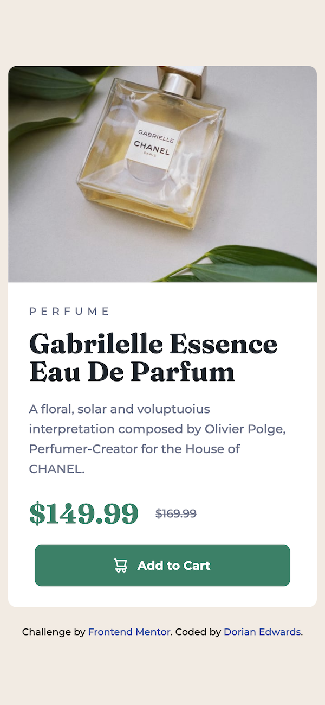

# Frontend Mentor - Product preview card component solution

This is a solution to the [Product preview card component challenge on Frontend Mentor](https://www.frontendmentor.io/challenges/product-preview-card-component-GO7UmttRfa). Frontend Mentor challenges help you improve your coding skills by building realistic projects.

## Table of contents

- [Overview](#overview)
  - [The challenge](#the-challenge)
  - [Screenshot](#screenshot)
  - [Links](#links)
- [My process](#my-process)
  - [Built with](#built-with)
  - [What I learned](#what-i-learned)
  - [Continued development](#continued-development)
  - [Useful resources](#useful-resources)
- [Author](#author)

## Overview

### The challenge

Users should be able to:

- View the optimal layout depending on their device's screen size
- See hover and focus states for interactive elements

### Screenshot



### Links

- [Solution](https://github.com/dorian-edwards/product-preview)
- [Live Site](https://dorian-edwards.github.io/product-preview/)

## My process

### Built with

- Semantic HTML5 markup
- Flexbox
- Mobile-first workflow
- [TypeScript](https://www.typescriptlang.org/)
- [Tailwindcss](https://tailwindcss.com/)
- [React](https://reactjs.org/)

### What I learned

The first thing that I had to start wrapping my head around was how to customize tailwindcss for my own needs. I'm still getting the hang of it but starting to work with [directives](https://tailwindcss.com/docs/functions-and-directives) was extraordinarily useful in not having to rewrite a ton of class names in every element.

```css
@layer utilities {
  .standard-text {
    @apply text-dk-gry-blu font-medium font-sans;
  }
}

@layer components {
  .tagline {
    @apply standard-text uppercase tracking-[5px];
  }

  .bold {
    @apply font-serif text-[3.2rem] leading-[3.2rem];
  }
}
```

I also combined `useEffect`, `useState` and an event listener on the window object to keep track of my breakpoint for desktop views so I could use [React's conditional rendering](https://reactjs.org/docs/conditional-rendering.html) to the specify the product image rather than media queries and srcset. I found [this](https://stackoverflow.com/questions/46586165/react-conditionally-render-based-on-viewport-size) answer on stack overflow helpful.

```tsx
import { useState, useEffect } from 'react'
import ProductImage from './ProductImage'
import ProductContent from './ProductContent'

const Card = () => {
  const [mobile, setMobile] = useState(window.innerWidth < 601)

  useEffect(() => {
    window.addEventListener('resize', function () {
      if (this.innerWidth < 601) return setMobile(true)
      if (this.innerWidth > 600) return setMobile(false)
    })
  }, [])

  return (
    <section className='card w-[95%] max-w-[60rem] mx-auto mb-[2rem] rounded-[1rem] overflow-hidden desktop:flex'>
      <ProductImage mobile={mobile} />
      <ProductContent />
    </section>
  )
}

export default Card
```

Within `ProductImage` I then render the component with the appropriate image based on the value of the value passed down through props. Here I had to specifiy the type of the value (my first real taste of typescript) using an interface. I'm still very unfamiliar with this concept and as my projects get more complex I'm sure I'll get more familiar.

I also specified my own custom definition of desktop using [tailwind's theme configuration](https://tailwindcss.com/docs/theme).

```tsx
export interface Props {
  mobile: boolean
}

const ProductImage = (props: Props) => (
  <div className='image-wrapper desktop:basis-1/2'>
    
  </div>
)

export default ProductImage
```

And last but not least, before building the React production build for deployment, I learned I have to add this line to my `package.json` or else github won't load one's assets. Found the fix [here](https://github.com/facebook/create-react-app/issues/12005).

```json
  "homepage": "./",
```

### Continued development

For future projects, in addition to becoming more comfortable with Tailwind and Typescript, I think I'll also try to keep re-usability in mind. Right now my components aren't very reusable, they're specific for this project; going forward I'll try to give more consideration to building things in such a way that I can re-use them, maybe even across projects

### Useful resources

- [TypeScript](https://www.typescriptlang.org/)
- [Tailwindcss](https://tailwindcss.com/)
- [React](https://reactjs.org/)
- [Setting up React with Typescript](https://reactjs.org/docs/static-type-checking.html#typescript)
- [Setting up React with Tailwind](https://tailwindcss.com/docs/guides/create-react-app)

## Author

- Website - [dorianedwards.dev](https://dorianedwards.dev)
- Frontend Mentor - [@dorian-edwards](https://www.frontendmentor.io/profile/dorian-edwards)
- Twitter - [@dorian_dev](https://twitter.com/dorian_dev)
- LinkedIn - [dorian-edwards](https://www.linkedin.com/in/dorian-edwards/)
